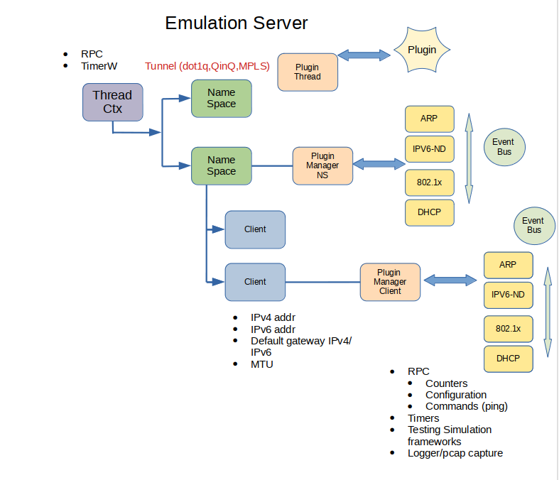
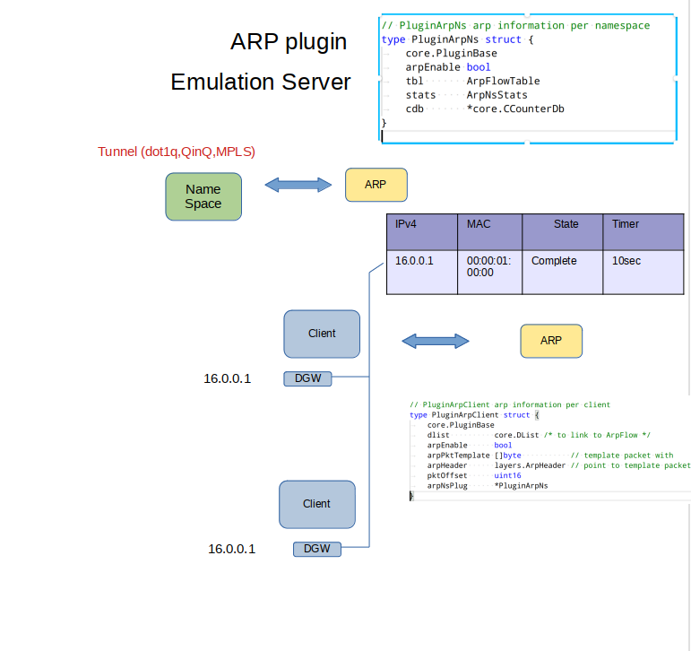

# TRex Emulation service

## Introduction

TRex Emulation service, or better known as TRex EMU aims to emulate hosts and implement client side protocols like ARP, IPv6, ND, MLD, IGMP, mDNS, DHCP in order to simulate a scale of clients and servers.

This project is not limited to client protocols, but it is a good start. The project provides a framework to implement and use client protocols.

The framework is fast enough for control plane protocols and will work with TRex server. Very fast L7 applications (on top of TCP/UDP) will run on TRex server. One single thread of TRex-EMU can achieve a high rate of client creation/teardown.

Each of the aforementioned protocol is implemented as a plugin. These plugins are self contained and can signal events one to the other, or to the framework, using an event-bus. (e.g. DHCP signals that it has a new IPv6 address).
The framework has an **event driven architecture**, this way it can scale. The framework also provides a protocol plugin infrastructure including:

- [x] RPC
- [x] Timers
- [x] Packet parsers
- [x] Simulation

## Properties

- [x] Fast client creation/teardown. ~3K/sec for one thread.
- [x] Number of active client/namespace is limited only by the memory on the server.
- [x] Packet per second (PPS) in the range of 3-5 MPPS.
- [x] Python3 Client API exposed through JSON-RPC.
- [x] Interactive support - Integrated with the TRex console.
- [x] Modular design. Each plugin is self contained and can be tested on its own.

## Supported protocols


| Plugin               | Description            |
| :---------:          |:-----------------------|
| ARP                  | RFC 826                |
| CDP                  | Cisco Delivery Protocol|
| DHCPv4               | RFC 2131 client side   |
| DHCPv6               | RFC 8415 client side   |
| DOT1X                | EAP-MD5/EAP-MSCHAPv2  RFC 3748/2759, IEEE 802.1X-2001|
| ICMP                 | RFC 777                |
| IGMP                 | IGMP v3/v2/v1 RFC3376  |
| IPv6                 | IPv6 ND, RFC 4443, RFC 4861, RFC 4862 and MLD and MLDv2 RFC 3810|
| LLDP                 | IEEE 802.1AB
| mDNS                 | Multicast DNS, RFC 6762
| Netflow              | Netflow v9, RFC 3954 and Netflow v10 (IPFix), RFC 7011 |
| Transport            | User space TCP (based on BSD, converted to native golang) and UDP |
| Cisco telemetry TDL  | Simulate TDL from network devices (incomplete) |


## TRex Architecture with TRex-EMU

The following image describes the TRex-EMU integration with TRex.


TRex-EMU can receive commands (RPC via JSON-RPC) from a Python client and send/receive packets via a ZMQ channel that connects it to the TRex server (RX core).

Packets from the network (from a TRex server physical port) that match a filter (dynamic) are forwarded to the TRex-EMU process.Packets from the EMU process are packed into the ZMQ channel and sent directly to the TRex physical port.

## TRex-EMU Architecture



Each TRex emulation process called `thread` can have a few `Namespaces`.

Each `Namespace` must have a unique tuple key, that is composed of `(physical-port, dot1q, QinQ)`. The namespace key could be extended to tunnels in the future. 

Each `Client` can be associated with one `Namespace` and each `Namespace` can contain multiple `Clients`.

Each `Protocol Plugin` can attach an opaque object at each level (thread, namespace, client) and run the protocol logic at that level. For example, DHCPv6 will be run mainly at the client level, while MLDv2 will run on a namespace context.

Different plugins and frameworks can communicate through an event bus. A plugin can register on a topic (Subscriber) and can send an event on a specific topic (Publisher) (e.g. DHCPv6 can send an event upon a change of a source IPv6).

Something to note in this model is that `Clients` can share information on the same `Namespace`, reducing multicast, broadcast and generally packet duplication.

For example, in case of mDNS/ARP we don't need to hold cache tables for each `Client` but we can hold one single cache table per `Namespace`.



The previous figure shows a shared IPv4 default gateway for many clients, which is resolved once and shared with all the respective clients. So ARP broadcast packets do not need to be duplicated for each client.
In this example, if all the clients had the same default gateway 16.0.0.1, we will have only one entry in the ARP cache table and each client will have a pointer to it. This is an example on how scaling in the number of clients can be achieved.

## How to?

### How to build?

In order to build:

```bash
cd scripts
source ./b
cd ../src/
go install -v cmd/trex-emu.go
```
or you can use our script:

```bash
cd scripts
./utility_script build -v
```

### How to test?

In order to run tests:

```bash
source ./b
cd src/
go test emu/core
go test emu/plugins/arp 
go test emu/plugins/cdp
go test emu/plugins/dhcpv4
go test emu/plugins/dhcpv6
go test emu/plugins/dot1x
go test emu/plugins/field_engine
go test emu/plugins/icmp
go test emu/plugins/igmp
go test emu/plugins/ipfix
go test emu/plugins/ipv6
go test emu/plugins/lldp
go test emu/plugins/mdns
go test emu/plugins/tdl
go test emu/plugins/transport
```

or you can use our script:

```bash
cd scripts
./utility_script test -v
```

### How to run?

In order to run Trex-EMU:

```bash
./$GOROOT/bin/trex-emu 
```

## Miscellaneous

---
**NOTE**

ZMQ was build to x86. You should add the shared object to the LDD path for installing the package.

---

## Tutorials

We can see all the clients:


We can see the ARP cache:


We can ping:

